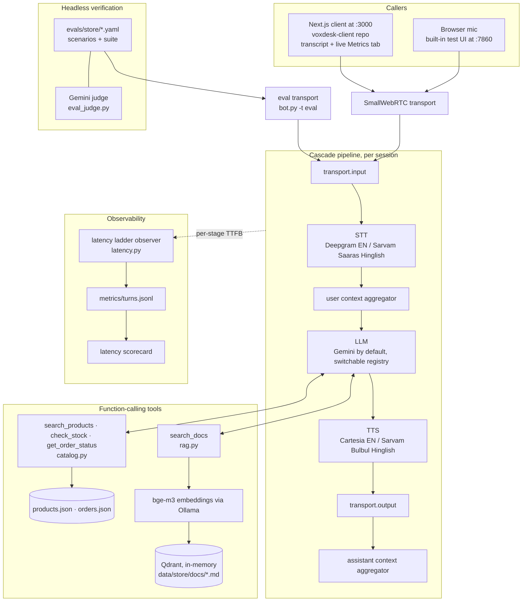

# VoxDesk

A Hinglish-capable voice support agent for a small business — built on a Pipecat
cascade pipeline (STT → LLM → TTS), grounded in local data and documents, and
shipped with the behavioral evals and latency scorecard that prove it works.

<!-- demo video: add link here -->

## Configuration

- **Bot Type**: Web
- **Transport(s)**: SmallWebRTC
- **Pipeline**: Cascade
  - **STT**: switchable — Deepgram (EN) / Sarvam Saaras (Hinglish)
  - **LLM**: switchable — OpenAI / Anthropic / Google
  - **TTS**: switchable — Cartesia (EN) / Sarvam Bulbul (Hinglish)
- **Features**:
  - **Pick STT / LLM / TTS from the UI** before connecting (dropdowns)
  - **Live metrics dashboard**: per-layer latency waterfall vs the ~1.2s target
  - **Observability**: per-turn console latency ladder + `metrics/turns.jsonl`
    (`server/latency.py`), surfaced live in the client's Metrics tab

Each layer has an `.env` default (`STT_MODEL` / `LLM_MODEL` / `TTS_MODEL`), which
the client dropdowns can override per session.

## Architecture

One process (`server/bot.py`) builds a per-session cascade pipeline. Audio comes
in over WebRTC from a browser; the same pipeline is driven headless by the eval
harness through the `eval` transport, so what the evals verify is the bot you
actually ship — not a mock.



The persona, the toolset, the data folder, and the eval folder are all keyed off
one `BUSINESS` profile (`server/business.py`), so the whole use case swaps
without touching the pipeline.

## Quickstart

Roughly ten minutes end to end, on free-tier keys. You need
[uv](https://docs.astral.sh/uv/) and Python 3.11+.

### Server

1. **Clone and enter the server directory**:

   ```bash
   git clone https://github.com/p-tirth/voxdesk-server.git
   cd voxdesk-server/server
   ```

2. **Install dependencies**:

   ```bash
   uv sync
   ```

3. **Configure environment variables**:

   ```bash
   cp .env.example .env
   # Edit .env and add your API keys
   ```

   You only need keys for the layers you actually run. The default stack is
   Deepgram STT → Gemini → Cartesia TTS; all four providers below have a free
   tier or free signup credits, no card required:

   | Key | Layer | Where to get it |
   | --- | --- | --- |
   | `GOOGLE_API_KEY` | LLM (`gemini-*`) | [aistudio.google.com](https://aistudio.google.com/apikey) — free tier |
   | `DEEPGRAM_API_KEY` | STT (`deepgram`) | [console.deepgram.com](https://console.deepgram.com) — free signup credits |
   | `CARTESIA_API_KEY` | TTS (`cartesia`) | [play.cartesia.ai](https://play.cartesia.ai) — free tier |
   | `SARVAM_API_KEY` | STT + TTS (Hinglish) | [dashboard.sarvam.ai](https://dashboard.sarvam.ai) — ₹100 free credits |

   The defaults (`deepgram` / `gemini-3-flash` / `cartesia`) run entirely on the
   first three keys; swap `LLM_MODEL` to `gemini-3.1-flash-lite` for the lowest
   latency, or see [Choosing models](#choosing-models-stt--llm--tts) for the
   full registry.

4. **For document search (`search_docs` / RAG), run Ollama with `bge-m3`**:

   ```bash
   # one-time: pull the local embedding model (~1.2 GB)
   ollama pull bge-m3
   # keep the daemon running (the macOS app does this; or `ollama serve`)
   ```

   Only needed if the active profile ships a `docs/` folder (the `store` profile
   does). Without it the bot still runs — `search_docs` just returns nothing.
   **Skip it on a first run** if you only want to hear the bot talk; come back
   for the policy/FAQ answers.

   Ollama is the **default** embedding backend (`RAG_BACKEND=ollama`) because it
   handles Hinglish best. If you'd rather not run a daemon, set
   `RAG_BACKEND=fastembed` in `.env`: embeddings then run in-process on ONNX with
   a ~67 MB model that downloads itself on first use, no Ollama at all. That's the
   zero-setup path (and what CI uses); retrieval is weaker on Hinglish, so keep
   `ollama` for the real demo. See [Documents & retrieval](#documents--retrieval-rag).

5. **Run the bot**:

   ```bash
   uv run bot.py
   ```

   Open <http://localhost:7860> and talk to it — that's the built-in test UI, no
   client build needed. (The runner serves every transport and the caller selects
   which one: a web/mobile client picks its transport when it connects; a
   telephony provider connects to `/ws`.) For the model dropdowns and the live
   metrics dashboard, run the [web client](#web-client-separate-repository) too.

## Configurable use case

The agent's use case is **not** hard-coded. A single business profile in
`server/business.py` drives both the bot's system prompt and which eval
scenarios apply. Switch the whole use case with `BUSINESS` in `server/.env`
(default `store`); add a new one by adding a profile entry plus a matching
`server/evals/<key>/` scenario folder.

## Choosing models (STT / LLM / TTS)

All three pipeline layers are switchable, and the choice can be made two ways:

- **From the UI** — the client (`:3000`) shows a dropdown per layer next to the
  Connect button. It lists only models whose API key is configured (the server
  advertises them at `/models`), and the selection is applied **at connect time**
  (dropdowns lock once connected — pick, then Connect). The choice rides along in
  the connect body and the bot builds that exact stack for the session.
- **From `.env`** — `STT_MODEL` / `LLM_MODEL` / `TTS_MODEL` set the defaults used
  when there's no UI selection (e.g. `uv run bot.py` alone, or evals). Each maps
  to a row in the matching registry in `bot.py` (`STT_REGISTRY`, `LLM_REGISTRY`,
  `TTS_REGISTRY`), where a model's provider, real model id, and required key live.

Options today:

| Layer | Options | Hinglish pick |
| --- | --- | --- |
| STT | `deepgram` (EN) · `sarvam` (Saaras `saaras:v3`, codemix) | `sarvam` |
| LLM | `gemini-3-flash` · `gemini-3.5-flash` · `gemini-3.1-flash-lite` (fastest) · `gemini-flash-lite` · `gemini-2.5-flash` · `gpt-5-mini` · `gpt-5-nano` · `sonnet-5` · `sonnet-4.6` | any |
| TTS | `cartesia` (EN) · `sarvam` (Bulbul) | `sarvam` |

Sarvam (STT + TTS) needs `SARVAM_API_KEY` — free credits at
[dashboard.sarvam.ai](https://dashboard.sarvam.ai) (₹100, no card). The spoken
language for language-aware TTS comes from the active business profile's
`tts_language` (the `store` profile uses `hi-IN`, which also pronounces English
product names naturally); Cartesia ignores it.

## Metrics dashboard (client)

The client has a **Metrics** tab (next to Conversation / Events) that turns the
pipeline's live RTVI metrics into a latency view, labeled with the models you
picked for this session:

- **Latest-turn waterfall** — STT → LLM → TTS time-to-first-byte stacked into one
  bar, with a dashed marker and OK/OVER flag against the ~1.2s target.
- **Per-layer cards** — latest TTFB plus rolling avg / p50 / p95 across the call.
- **End-to-end trend** — a bar per recent turn (green under target, red over).

It's the browser-side companion to the server's console latency ladder
(`server/latency.py`), reading the same metrics the pipeline emits.

## Tools & product data

The bot answers questions about products, stock, and orders by **calling tools**
that look the answer up in local data — so those answers are grounded in real
records, not guessed. Nothing here is a service or an external database:

- **`server/data/<BUSINESS>/`** — the "database": `products.json` (the catalog)
  and `orders.json` (sample orders), loaded into memory at boot. Swap the data
  by editing these files; it swaps with the use case (`BUSINESS`).
- **`server/catalog.py`** — loads that data and does plain in-memory search
  (deterministic, instant, no embeddings).
- **`server/tools.py`** — the function-calling tools the LLM can invoke:
  `search_products` (what do you sell / do you carry X), `check_stock` (is a
  specific item available), `get_order_status` (look up an order number), and
  `search_docs` (policy/FAQ questions — see RAG below). Each profile picks its
  toolset in `TOOLSETS`.

Structured vs. unstructured: a product catalog is structured data, so the catalog
tools are exact substring lookups (deterministic, testable, no embeddings). Prose
questions — returns, warranty, shipping, payments — aren't a field lookup, so they
go through `search_docs`, a separate retrieval tool over the FAQ/policy documents.

## Documents & retrieval (RAG)

`search_docs` answers policy / how-it-works questions from a small corpus of prose
docs, grounded in the text rather than guessed. It's a thin, fully-local setup —
no cloud, no API key:

- **`server/data/<BUSINESS>/docs/*.md`** — the corpus (for `store`: returns,
  warranty, shipping, payments), split into paragraph chunks. Edit these to change
  what the bot knows; add a `docs/` folder to give another profile documents.
- **`server/rag.py`** — a `DocStore` that embeds the corpus at boot and searches it:
  - **Embeddings: `bge-m3` via Ollama** (local, multilingual — handles Hinglish).
    Needs the Ollama daemon running with the model pulled (`ollama pull bge-m3`);
    override the host/model with `OLLAMA_BASE_URL` / `RAG_EMBED_MODEL`.
  - **Vector store: Qdrant, embedded** (`QdrantClient(":memory:")` — in-process, no
    server/Docker). The same client points at a Qdrant Docker server later, so
    growing to a persistent store for a bigger corpus is a one-line change.
- **The embedding backend is a switch, not a hard dependency.** `RAG_BACKEND` picks
  it: `ollama` (default — `bge-m3`, best Hinglish, needs the daemon), `fastembed`
  (in-process ONNX, `BAAI/bge-small-en-v1.5`, ~67 MB, **no daemon**), or `none` (no
  doc store at all). `fastembed` exists so the doc evals can run in CI without
  installing Ollama; it's a real quality trade, measured — on the store corpus both
  backends route 12/12 of the standard question battery correctly, but on harder
  Hinglish phrased with no English keywords they drop to 4-5 out of 8. The demo
  stack stays on `ollama`. Each backend has its own model env var
  (`RAG_EMBED_MODEL` is an Ollama tag, `RAG_FASTEMBED_MODEL` a Hugging Face repo
  id) and its own calibrated score floor; `uv run python
  scripts/check_retrieval.py` runs that battery against whichever backend is
  configured and prints every query's top hit and score.
- **Recall-first + LLM judges relevance.** Retrieval uses a lenient floor and hands
  the closest passages to the LLM, which answers only if they actually address the
  question and otherwise declines — so the bot refuses off-corpus questions instead
  of forcing an answer from a loosely-similar passage. (A dense+sparse hybrid would
  sharpen this; overkill for a handful of docs.)

  Why the floor is deliberately low: measured on this corpus, grounded and
  off-corpus similarity scores overlap, and **Hinglish questions score lower than
  the English equivalent** (the corpus is English), so a cutoff strict enough to
  reject off-corpus questions would silently drop real Hinglish matches. The floor
  only filters junk; relevance is the LLM's call.

> **Swapping the embedding model?** Set `RAG_EMBED_MODEL` to any model your Ollama
> has (the vector dimension is detected automatically, so nothing else needs to
> change) — but the relevance floor `DEFAULT_MIN_SCORE` in `server/rag.py` is
> calibrated to **bge-m3's** score distribution. Other models score on different
> scales, so re-check it: embed a few questions that should hit and a few that
> shouldn't, then set the floor below the ones that should hit.

A document lookup costs roughly **140ms** (query embedding + vector search) and
only happens on turns where the LLM calls `search_docs` — other turns are
unaffected.

If Ollama is unreachable at boot, the store degrades to empty (no crash) — the bot
just has no document knowledge.

## Latency ladder

In a voice call the only number a caller feels is *how long the silence lasted*,
so the bot measures every turn as a waterfall of the stages that make up that
silence:

```
user stops speaking
  └─ STT   time-to-first-byte   transcript starts arriving
      └─ LLM   time-to-first-byte   first token
          └─ TTS   time-to-first-byte   first audio byte
              └─ bot starts speaking
─────────────────────────────────────────────────────────
end-to-end (user silence → bot speech)   vs. target ≤ 1.2s
```

The target is **~1.2s end-to-end**, and each turn is flagged `OK` or `OVER`
against it — the point of splitting the ladder is that when a turn goes over you
can see *which* stage ate the budget instead of guessing. Tool turns show their
function-call duration too (a `search_docs` lookup adds ~140ms).

It lands in three places, all from the same measurements:

- **Console** — the ladder prints after every turn (`server/latency.py`, built on
  Pipecat's `UserBotLatencyObserver`).
- **`server/metrics/turns.jsonl`** — one JSON row per turn (per-stage TTFB,
  end-to-end, function calls), which is what the [scorecard](#scorecard)
  aggregates.
- **The client's Metrics tab** — the same numbers live in the browser as a
  waterfall, per-layer avg/p50/p95, and an end-to-end trend (see
  [Metrics dashboard](#metrics-dashboard-client)).

It fires on real/audio turns (a browser call or an audio-mode eval); text-mode
evals bypass VAD, so it stays quiet there.

## Scorecard

The scorecard is the honest version of the latency claim: p50/p95 end-to-end and
per-stage latency, grouped by model stack, computed from the turns actually
measured in `server/metrics/turns.jsonl` — no hand-picked runs, and numbers that
miss the 1.2s target stay in the table.

<!-- scorecard:start -->
### Latency scorecard

End-to-end turn latency (user stops speaking → bot starts speaking), measured on real audio calls (eval-harness turns excluded). Target: **p95 ≤ 1.2s** — rows that miss it are marked ❌ and published anyway. All times in seconds; TTFB is the first response per stage in a turn. Outliers (cold starts) are *not* filtered.

| Stack (LLM + TTS) | STT | Turns (e2e / all) | e2e p50 | e2e p95 | LLM p50 | LLM p95 | TTS p50 | TTS p95 | Tool turns | Target |
|---|---|---:|---:|---:|---:|---:|---:|---:|---:|:--:|
| gemini-2.5-flash + sonic-3.5 | nova-3-general | 30 / 43 | 1.71 | 4.38 | 0.96 | 1.79 | 0.11 | 0.17 | 15 | ❌ |
| gemini-3-flash-preview + bulbul:v2 | — | 0 / 28 | — | — | 10.06 | 21.10 | 0.69 | 1.80 | 27 | n/a |
| gemini-2.5-flash + bulbul:v2 | nova-3-general / saaras:v3 | 11 / 15 | 2.99 | 6.01 | 1.05 | 1.53 | 0.57 | 0.96 | 5 | ❌ |
| gemini-flash-lite-latest + bulbul:v2 | saaras:v3 | 14 / 15 | 2.81 | 5.30 | 0.77 | 1.06 | 0.60 | 0.93 | 2 | ❌ |
| gemini-3.1-flash-lite + sonic-3.5 | nova-3-general | 5 / 6 | 4.03 | 4.65 | 0.67 | 1.05 | 0.10 | 0.18 | 2 | ❌ |
| gemini-3-flash-preview + sonic-3.5 | — | 1 / 2 | 4.30 | 4.30 | 0.11 | 23.72 | 0.09 | 0.09 | 1 | ❌ |
| **All stacks** | nova-3-general / saaras:v3 | 61 / 109 | 2.60 | 4.92 | 1.05 | 17.85 | 0.34 | 0.96 | 52 | ❌ |

<sub>109 turns aggregated (0 malformed line(s) skipped) from `server/metrics/turns.jsonl` — 0 live, 109 untagged, 40 eval rows excluded — `--include-eval` to include them. Regenerate with `uv run python metrics_summary.py --update-readme`.</sub>
<!-- scorecard:end -->

## Testing with evals

Behavioral evals are scripted conversations that drive the bot headless — no live
call needed. Scenarios for the active use case live in `server/evals/<BUSINESS>/`
(e.g. `server/evals/store/`), including `function_call` checks that assert the
tools actually fire. This includes two RAG scenarios: `docs_grounded` (a policy
question → asserts `search_docs` fires and the answer is grounded in the doc) and
`docs_refusal` (an off-corpus question → asserts the bot declines and invents
nothing). The judge LLM is configured once in
`server/evals/_shared/judge_eval.yaml`.

Note: the doc scenarios need Ollama + `bge-m3` running (see Setup). Run the suite
serially (or expect occasional timeout flakes) — under high concurrency the
Ollama embed calls contend and a slow turn can exceed the response window.

Use `python -m pipecat.evals` (not `pipecat eval`) so the working dir is
importable — the judge factory in `eval_judge.py` needs it.

**Whole suite (recommended):** the `suite` runner spawns a *fresh bot per
scenario*, so there's no context bleed between runs. From `server/`:

```bash
uv run python -m pipecat.evals suite evals/store/suite.yaml
```

**Iterating on one scenario (fast inner loop):** boot the bot once and drive
scenarios against it from a second terminal (the bot stays up across runs):

```bash
uv run bot.py -t eval
# In another terminal (server/):
uv run python -m pipecat.evals run evals/store/products.yaml -v          # one scenario
uv run python -m pipecat.evals run evals/store/audio_roundtrip.yaml -v   # full audio round trip
```

> Note: running many scenarios against one long-lived bot (`run` with several
> files) lets context carry over between them, which can flake the greeting turn.
> Use `suite` for a clean full-suite pass.

By default the judge reuses your `GOOGLE_API_KEY` via Gemini's OpenAI-compatible
endpoint (no extra key or model download). To switch to Ollama (`ollama pull
gemma2:9b`) or OpenAI, edit `server/evals/_shared/judge_eval.yaml`.

## Web client (separate repository)

The browser client — model dropdowns, transcript, and the live metrics dashboard
— lives in its own repo: **[voxdesk-client](https://github.com/p-tirth/voxdesk-client)**.
It's optional: the bot serves a built-in test UI at `http://localhost:7860`, so
you can talk to it without the client at all.

To run the full setup, clone the client next to this repo and start it:

```bash
git clone https://github.com/p-tirth/voxdesk-client.git
cd voxdesk-client
npm install
cp env.example .env.local     # defaults to the bot at localhost:7860
npm run dev                   # → http://localhost:3000
```

Keep the bot (`uv run bot.py`) running in another terminal; the client proxies to
it and reads `GET /models` to populate its dropdowns.

## Project Structure

This repository is the **bot server**. (The web client is a separate repo — see
above.)

```
voxdesk-server/
├── server/                  # Python bot server
│   ├── bot.py               # Pipeline + STT/LLM/TTS registries + /models endpoint
│   ├── business.py          # Configurable business profiles (persona + prompt)
│   ├── catalog.py           # Structured data loader/search (products, orders)
│   ├── rag.py               # Document retrieval: embeddings + in-memory Qdrant
│   ├── tools.py             # Function-calling tools + per-profile toolsets
│   ├── latency.py           # Per-turn latency ladder
│   ├── eval_judge.py        # Gemini-backed eval judge factory
│   ├── data/<business>/     # products.json + orders.json …
│   │   └── docs/            # …plus the FAQ/policy corpus for search_docs
│   ├── evals/               # Behavioral eval scenarios (+ suite.yaml)
│   ├── scripts/             # Helper scripts (e.g. generate_tts_preview.py)
│   ├── recordings/          # TTS preview page + sample audio (git-ignored)
│   ├── metrics/             # Per-turn latency JSONL log (git-ignored)
│   ├── pyproject.toml       # Python dependencies
│   ├── .env.example         # Environment variables template
│   ├── .env                 # Your API keys (git-ignored)
│   └── ...
├── .gitignore
└── README.md                # This file
```

Also generated at runtime and git-ignored: `server/metrics/turns.jsonl`,
`server/recordings/`, and `server/eval-runs/`.

## Observability

What's wired in this project:

- **Console latency ladder** — the per-turn STT/LLM/TTS waterfall printed after
  every audio turn (`server/latency.py`; see [Latency ladder](#latency-ladder)).
- **`metrics/turns.jsonl`** — one JSON row per turn for later aggregation.
- **Client Metrics tab** — the same live RTVI metrics rendered as a latency
  dashboard in the browser (see [Metrics dashboard](#metrics-dashboard-client)).

### Whisker — Live Pipeline Debugger (optional, not wired)

**Whisker** is Pipecat's live graphical debugger for visualizing pipelines and
inspecting frames in real time. It is **not enabled in this repo** — there's no
`pipecat-ai-whisker` dependency and no `WhiskerObserver` in `bot.py`. To add it:

1. Add the dependency: `uv add pipecat-ai-whisker` (in `server/`).
2. Attach the observer in `bot.py` alongside the latency one:

   ```python
   from pipecat_whisker import WhiskerObserver
   # ...
   observers=[latency_observer, WhiskerObserver(pipeline)],
   ```

3. Run the bot, expose port 9090 (e.g. `ngrok http 9090`), then open
   [https://whisker.pipecat.ai/](https://whisker.pipecat.ai/) and enter the URL.

## Production gaps I know about

This is a demo I'd be happy to have picked apart, so here's the list I'd raise
myself. None of these are oversights — they're scope calls I made to get the
voice loop, the tools, and the eval harness right first.

- **No caller verification on order lookup.** `get_order_status` will read out
  any order number it's given — there's no "confirm the phone number on the
  order" step. Real support needs one; the demo data is fake, so I left the
  identity check out rather than fake it.
- **No telephony — browser mic only.** Deliberate v1 scope. The bot runs on
  SmallWebRTC; adding a phone number means a WebSocket transport plus a provider
  serializer, which is a real integration, not a config flag.
- **Audio-mode evals are English-only upstream.** The eval harness transcribes
  the bot's speech with a local English-only model, so Hinglish turns can't be
  judged from audio. Hinglish is therefore verified in text mode, where the
  judge reads the LLM's text directly — which tests the brain, not the ears. A
  Hinglish transcriber in the eval path would close this.
- **The best `search_docs` quality still needs a local Ollama daemon with
  `bge-m3` pulled.** That's a real setup dependency (~1.2 GB, one more thing
  running) and the biggest tax on the ten-minute quickstart. There's now an
  escape hatch — `RAG_BACKEND=fastembed` runs embeddings in-process with a ~67 MB
  model and no daemon — but it's a fallback, not a replacement: it's noticeably
  weaker on Hinglish questions phrased without English keywords, which is exactly
  the traffic this bot is for. So the gap narrows rather than closes: the
  zero-setup path exists (and is what CI uses), the daemon-free quality is not yet
  good enough to make it the default.
- **The retrieval score floor is calibrated to one embedding model.**
  `DEFAULT_MIN_SCORE = 0.35` in `rag.py` was measured against **bge-m3's** score
  distribution on this corpus. Swapping `RAG_EMBED_MODEL` changes the scale, so
  the floor has to be re-checked against a handful of should-hit and
  shouldn't-hit questions — it won't fail loudly if you forget.
- **The doc index is in-memory and rebuilt on every boot.** Fine at 13 chunks
  (embedding the corpus is a couple of seconds); wrong at a few thousand. The
  growth path is pointing the same Qdrant client at a server instead of
  `":memory:"` — one line, plus a re-index step.
- **`/start` and `/models` are unauthenticated.** Anyone who can reach the port
  can start a session and burn provider credits. That's fine for localhost and
  not fine for anything public — it needs auth and rate limiting before it's
  exposed.
- **`search_docs` is verified in text-mode evals, not on the live audio path.**
  The routing and grounding behavior is covered by scenarios; the same tool over
  real STT/TTS is still manual spot-checking. An audio-mode doc scenario is the
  fix, once the transcriber above can handle the language mix.

## Building with an AI coding agent

Extending this bot with Claude Code, Codex, or another AI coding assistant? Give it live, accurate Pipecat context instead of stale training data with the **Pipecat Context Hub** — a local index of Pipecat docs, examples, and API source your agent queries over MCP:

```bash
# Build the local index (first run takes a couple of minutes)
uvx pipecat-ai-context-hub@latest refresh

# Add it to your agent (use the line for the one you use)
claude mcp add pipecat-context-hub -- uvx pipecat-ai-context-hub serve   # Claude Code
codex mcp add pipecat-context-hub -- uvx pipecat-ai-context-hub serve    # Codex
```

MCP servers load at session start, so add it before opening your coding session. See the [Pipecat Context Hub docs](https://docs.pipecat.ai/api-reference/context-hub) for the full setup.

## Learn More

- [Pipecat Documentation](https://docs.pipecat.ai/)
- [Voice UI Kit Documentation](https://voiceuikit.pipecat.ai/)
- [Pipecat GitHub](https://github.com/pipecat-ai/pipecat)
- [Pipecat Examples](https://github.com/pipecat-ai/pipecat-examples)
- [Discord Community](https://discord.gg/pipecat)